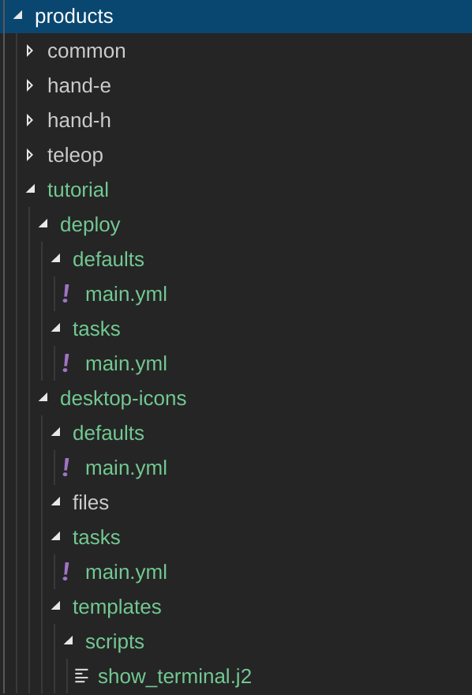
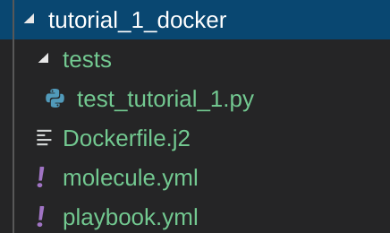
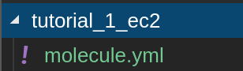
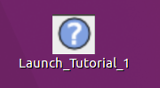
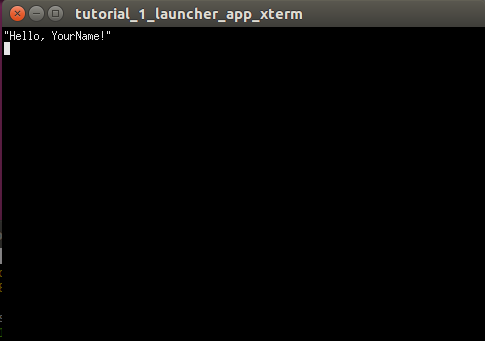

# Table of Contents
- [Introduction](#introduction)
- [How to run](#how-to-run)
  * [teleop_deploy](#teleop_deploy)
  * [server_and_nuc_deploy](#server_and_nuc_deploy)
  * [docker_deploy](#docker_deploy)
  * [configure_software](#configure_software)
  * [install_software](#install_software)
  * [install_python3](#install_python3)
- [Development](#development)
  * [Development Docker](#development-docker)
- [Testing](#testing)
  * [Test creation](#test-creation)
  * [Unlimited scroll in terminator](#unlimited-scroll-in-terminator)
  * [Testing with molecule_docker](#testing-with-molecule_docker)
  * [Debugging and Lint](#debugging-and-lint)
  * [Private docker images](#private-docker-images)
  * [Testing with molecule_ec2](#testing-with-molecule_ec2)
  * [Credentials](#credentials)
  * [Automatic tests](#automatic-tests)
  * [Testing on real hardware](#testing-on-real-hardware)
- [Structure of files](#structure-of-files)
  * [Roles](#roles)
  * [Docker](#docker)
  * [Installation](#installation)
  * [Products](#products)
  * [Common](#common)
  * [Templating](#templating)
  * [Dependencies](#dependencies)
- [Playbooks](#playbooks)
  * [Playbook creation](#playbook-creation)
- [Inventories](#inventories)
- [Syntax and rules](#syntax-and-rules)
- [Special variables](#special-variables)
- [Tutorial 1 desktop icon](#tutorial-1-desktop-icon)
- [Troubleshooting](#troubleshooting)

# Introduction #

Aurora is an installation automation tool using Ansible. It uses Molecule for testing Ansible scripts and it has automated builds in AWS EC2/CodeBuild and DockerHub. It can be used to develop, test and deploy complicated, multi-machine, multi-operating-system automated installs of software. Aurora's purpose is to unify one-liners approaches based on Ansible best practices.

For example, it's possible to use Aurora to install Docker, download the specified image and create a new container for you. It will also create a desktop icon to start the container and launch the hand.

Ansible user guide is available [here](https://docs.ansible.com/ansible/latest/user_guide/index.html) (Aurora is currently using Ansible 2.10.4)

Molecule user guide is available [here](https://molecule.readthedocs.io/en/latest/) (Aurora is currently using Molecule 3.2.1)

# How to run #

## teleop_deploy ##

If using real robots, teleop_deploy will deploy software on a laptop (called "server" in this playbook) and a control machine (NUC). If remote_teleop=true, then software will also be deployed on a third computer (called "client").

Teleop_deploy can also be used fully in simulation, in which case only 1 computer is required (called "server" in this playbook)

To begin with, the teleop_deploy playbook checks the installation status of docker. If docker is not installed then a new clean installation is performed. Then the specified docker image is pulled and a docker container is initialized. Finally, desktop shortcuts are generated. This shortcuts start the teleop software and run the arm(s) and the hand(s).

**How to run:**

You will be asked for a docker_username and docker_password (for a Docker Hub account that has access to Shadow's private teleop Docker images), then a sudo_password (i.e. the password of the user with sudo permissions) for the laptop you are using to run this playbook, and also for the Vault password, which is provided by Shadow.

Open a terminal with Ctrl+Alt+T and run:

```bash
bash <(curl -Ls bit.ly/run-aurora) teleop_deploy --inventory name_of_inventory --read-input docker_username --read-secure docker_password  option1=value1 option2=value2 option3=value3
```
name_of_inventory can be staging_a, staging_b, production or simulation.

Or if you are using remote_teleop=true, they are staging_a_remote, staging_b_remote or production_remote.

If no inventory name is provided, and if remote_teleop is not specified or false, then "production" will be automatically selected.

If no inventory name is provided, and if remote_teleop=true, then "production_remote" will be automatically selected.

Example for real robots with haptx bimanual teleop:

```bash
bash <(curl -Ls bit.ly/run-aurora) teleop_deploy --inventory production --read-input docker_username --read-secure docker_password ethercat_right_hand=enx000ec6bfe185 ethercat_left_hand=enx000ec6c042d5 config_branch=bimanual_demohands_B_D reinstall=true bimanual=true use_aws=true upgrade_check=true image="shadowrobot/teleop-haptx-binary" tag="melodic-v0.0.1" glove=haptx use_steamvr=false arm_ip_right="10.8.1.1" arm_ip_left="10.8.2.1" ethercat_right_arm=eno1 ethercat_left_arm=enx000ec6bfe175 
```

Example for simulated robots without a real vive system or real gloves:

```bash
bash <(curl -Ls bit.ly/run-aurora) teleop_deploy --inventory simulation --read-input docker_username --read-secure docker_password reinstall=true upgrade_check=true image="shadowrobot/teleop-haptx-binary" tag="melodic-v0.0.1" glove="haptx" real_glove=false real_vive=false
```

Inventories correspond to fixed IP addresses as shown here:
* [staging_b](ansible/inventory/teleop/staging_b)
* [staging_b_remote](ansible/inventory/teleop/staging_b_remote)
* [staging_a](ansible/inventory/teleop/staging_a)
* [staging_a_remote](ansible/inventory/teleop/staging_a_remote)
* [production](ansible/inventory/teleop/production)
* [production_remote](ansible/inventory/teleop/production_remote)
* [simulation](ansible/inventory/teleop/simulation)

Options for teleop_deploy playbook are here for the following machines:
* [server](ansible/inventory/teleop/group_vars/server.yml)
* [control-machine](ansible/inventory/teleop/group_vars/control_machine.yml)
* [client](ansible/inventory/teleop/group_vars/client.yml)
* [simulation](ansible/inventory/teleop/group_vars/simulation.yml)

Run a playbook against one or more members of that group using the --limit tag:

* --limit rules (e.g. --limit 'all:!server' please use single quotes. More details could be found 
[here](https://ansible-tips-and-tricks.readthedocs.io/en/latest/ansible/commands/#limit-to-one-or-more-hosts))

For assigning input and secure input to playbook variables you can use the tags: --read-input var1, var2, var3 ... and --read-secure secure_var1, secure_var2, secure_var3 ... respectively

* --read-input vars (vars = comma-separated list, e.g. --read-input docker_username - To allow aurora script to prompt for docker username)
* --read-secure secure_vars (secure_vars = comma-separated list, e.g. --read_secure docker_password - To allow aurora script to prompt for docker password, or e.g. --read-secure docker_password,customer_key - To allow aurora script to prompt for ROS logs upload key)

**VAULT password:**

Shadow will supply you with the Vault password, which is needed to decrypt some credentials to access the NUC.

## server_and_nuc_deploy ##

For Hand E/G/H software deployments on a laptop (called "server" in this playbook) and a control machine (NUC)

To begin with, the server_and_nuc_deploy playbook checks the installation status of docker. If docker is not installed then a 
new clean installation is performed. If the required image is private, 
then a valid Docker Hub account with pull credentials from Shadow Robot's Docker Hub is required. Then the specified docker image is pulled and a docker 
container is initialized. Finally, a desktop shortcut is generated. This shortcut starts the docker container and 
launches the hand.

**How to run:**

You will be asked for a sudo_password (i.e. the password of the user with sudo permissions) for the laptop you are using to run this playbook, and also for the Vault password, which is provided by Shadow.

Open a terminal with Ctrl+Alt+T and run:

```bash
bash <(curl -Ls bit.ly/run-aurora) server_and_nuc_deploy option1=value1 option2=value2 option3=value3
```

Example:

```bash
bash <(curl -Ls bit.ly/run-aurora) server_and_nuc_deploy product=hand_e ethercat_right_hand=enx5647929203 config_branch=demohand_C
```
Inventories correspond to fixed IP addresses as shown here:
* [staging_b](ansible/inventory/server_and_nuc/staging_b)
* [staging_a](ansible/inventory/server_and_nuc/staging_a)
* [production](ansible/inventory/server_and_nuc/production)

Options for server_and_nuc_deploy playbook are here for the following machines:
* [server](ansible/inventory/server_and_nuc/group_vars/server.yml)
* [control-machine](ansible/inventory/server_and_nuc/group_vars/control_machine.yml)

Run a playbook against one or more members of that group using the --limit tag:

* --limit rules (e.g. --limit 'all:!server' please use single quotes. More details could be found 
[here](https://ansible-tips-and-tricks.readthedocs.io/en/latest/ansible/commands/#limit-to-one-or-more-hosts))

For assigning input and secure input to playbook variables you can use the tags: --read-input var1, var2, var3 ... and --read-secure secure_var1, secure_var2, secure_var3 ... respectively

* --read-input vars (vars = comma-separated list, e.g. --read-input docker_username - To allow aurora script to prompt for docker username)
* --read-secure secure_vars (secure_vars = comma-separated list, e.g. --read-secure docker_password,customer_key - To allow aurora script to prompt for the docker hub password and the ROS logs upload key)

**VAULT password:**

Shadow will supply you with the Vault password, which is needed to decrypt some credentials to access the NUC.

## docker_deploy ##

For Hand E/G/H software deployments on single laptop.

To begin with, the docker_deploy playbook checks the installation status of docker. If docker is not installed then a 
new clean installation is performed. If the required image is private, 
then a valid Docker Hub account with pull credentials from Shadow Robot's Docker Hub is required. Then the specified docker image is pulled and a docker 
container is initialized. Finally, a desktop shortcut is generated. This shortcut starts the docker container and 
launches the hand.

**Ethercat interface**

Before running the docker_deploy playbook, the ethercat_right_hand parameter for the hand needs to be discovered. In order to do so, after plugging the hand’s ethernet cable into your machine and powering it up, please run
```shell
sudo dmesg
```
command in the console. At the bottom, there will be information similar to the one below:
```shell
[490.757853] IPv6: ADDRCONF(NETDEV_CHANGE): enp0s25: link becomes ready
```
In the above example, ‘enp0s25’ is the ethercat_right_hand that is needed.

**How to run:**

Open a terminal with Ctrl+Alt+T and run:

```bash
bash <(curl -Ls bit.ly/run-aurora) docker_deploy ethercat_right_hand=enp0s25 option1=value1 option2=value2 option3=value3
```

Example:

```bash
bash <(curl -Ls bit.ly/run-aurora) docker_deploy product=hand_e ethercat_right_hand=enp0s25 config_branch=demohand_C
```
Options for docker_deploy playbook are [here](ansible/inventory/local/group_vars/docker_deploy.yml)

For assigning input and secure input to playbook variables you can use the tags: --read-input var1, var2, var3 ... and --read-secure secure_var1, secure_var2, secure_var3 ... respectively

* --read-input vars (vars = comma-separated list, e.g. --read-input docker_username - To allow aurora script to prompt for docker username)
* --read-secure secure_vars (secure_vars = comma-separated list, e.g. --read_secure docker_password - To allow aurora script to prompt for docker password, or e.g. --read-secure docker_password,customer_key - To allow aurora script to prompt for ROS logs upload key)

**BECOME password:**

If you are prompted for a BECOME password, enter the sudo password of the computer you are using. 

## configure_software ##

This runs the docker/setup-ui role (details are [here](ansible/roles/docker/setup-ui/tasks/main.yml) when it is passed a list of software which includes 'setup-docker'. This is used in the DockerHub Docker image builds for Aurora

**How to run:**

Open a terminal with Ctrl+Alt+T and run:

```bash
bash <(curl -Ls bit.ly/run-aurora) configure_software software=['setup-docker']
```

## install_software ##

This installs software based on external parameters (details are [here](https://github.com/shadow-robot/aurora/blob/master/ansible/playbooks/install_software.yml) when it is passed a list of software. This is used in the DockerHub Docker image builds for Aurora and also builds of shadow-teleop Docker images

**How to run:**

Open a terminal with Ctrl+Alt+T and run:

```bash
bash <(curl -Ls bit.ly/run-aurora) install_software software=['software1','software2','software3']
```
Example:

```bash
bash <(curl -Ls bit.ly/run-aurora) install_software software=['docker','aws-cli']
```

## install_python3 ##

This installs the default Python3 for Ubuntu 16.04 and 18.04 (Python 3.5.2). Details [here](https://github.com/shadow-robot/aurora/blob/master/ansible/playbooks/install_python3.yml). It also sets ansible_python_interpreter correctly for Python3 

**How to run:**

Open a terminal with Ctrl+Alt+T and run:

```bash
bash <(curl -Ls bit.ly/run-aurora) install_python3
```
# Development #

The recommended way to develop code for this project is to pull a certain docker image ([Development Docker](#development-docker)) with a lot of tools already installed and open a container of this image, then clone the aurora GitHub repository inside it. It is not recommended to clone aurora directly on your local machine while you do development and testing.

## Development Docker ##

The docker images used for aurora development are [here](https://cloud.docker.com/u/shadowrobot/repository/docker/shadowrobot/aurora-molecule-devel).

Currently both xenial and bionic tags are working well.

Use the tag that matches your host operating system.

The rest of the document assumes the user is using bionic tag.

Instructions on how to use this:
1. Use Ubuntu 16.04 or Ubuntu 18.04 computer

2. Install Docker (using instructions from [here](https://docs.docker.com/install/linux/docker-ce/ubuntu/))

3. Run the following command in terminal to create a container for aurora development:

```
docker run -it --name aurora_dev -e DISPLAY -e QT_X11_NO_MITSHM=1 -e LOCAL_USER_ID=$(id -u) -v /var/run/docker.sock:/var/run/docker.sock -v /tmp/.X11-unix:/tmp/.X11-unix:rw shadowrobot/aurora-molecule-devel:bionic
```
4. Once the container has launched, clone aurora to home directory:
```
git clone https://github.com/shadow-robot/aurora.git
```
5. Go into the aurora folder:
```
cd aurora
```
6. Open Visual Studio Code which is already installed inside the Docker container:
```
code .
```

# Testing #

## Test creation ##

Create test case for both docker in ansible/playbooks/molecule_docker/molecule folder and for AWS EC2 in ansible/playbooks/molecule_ec2/molecule folder. For additional molecule_docker tests, copy the folder structure from other tests and modify the .py, converge.yml and molecule.yml files in tests folder.For additional molecule_ec2 tests, copy the folder structure of another EC2 test and modify the molecule.yml file inside. The EC2 tests just run the same tests as the Docker tests, but they do it in AWS EC2, using virtual machines, not Docker.

## Unlimited scroll in terminator ##

Before executing any tests, it is very useful to make sure you have unlimited scroll in terminator, because Molecule produces a lot of debug logs. Follow these steps to enable it: right click on the Terminator -> Preferences -> Profiles -> Scrolling and select Infinite scrollback.

## Testing with molecule_docker ##

Once you have written your code for aurora in your branch, test it locally with Molecule first before pushing to GitHub.

There are some molecule_docker tests which require connecting to AWS to download files (such as downloading the hand manual). For this reason, before running any Molecule tests, ask the system administrator for your AWS access key and secret access key. Then, in the docker container terminal, type:
```
export AWS_ACCESS_KEY=your_key
export AWS_SECRET_KEY=your_secret
```

1. In the docker container terminal execute the following command:

```
cd /home/user/aurora/ansible/playbooks/molecule_docker
```

2. Start with testing only your test case, without extra debug statements:

```
molecule test -s name_of_your_test_case
```

3. Fix any errors. If you want more debug information, execute the following:
```
molecule --debug test -s name_of_your_test_case
```
The --debug flag produces a lot of information. Remember to scroll up to see any possible lint or other errors that might have occurred.

4. Now test all test cases to check for effects on other aurora components and knock-on-effects:
```
molecule test --all
```
5. Fix any errors. If you want more debug information, execute the following:
```
molecule --debug test all
```

6. Often it is useful to run Molecule in stages (create, converge, verify, login (if necessary), and finally destroy) for better debugging (so you can inspect every stage yourself). See [this](https://molecule.readthedocs.io/en/stable/usage.html) page, and do, for example:
```
molecule create -s name_of_your_test_case
molecule converge -s name_of_your_test_case
molecule verify -s name_of_your_test_case
molecule login -s name_of_your_test_case
molecule destroy -s name_of_your_test_case
```

## Debugging and Lint ##

1. For a successful test, Molecule requires that all lint checks (yaml lint, flake8 python lint and ansible lint) pass. The AWS EC2 build will fail if any lint check fails or if any Molecule test fails.

2. In the Molecule logs, do a text search for "error" or "error occurred" as well as "failure" and "fatal".

3. You can add the --debug flag after molecule for more debug information, but remember to scroll up to see any possible lint or other errors that might have happened.

4. It's useful to enable [Unlimited scroll in terminator](#unlimited-scroll-in-terminator)

## Private docker images ##

At the moment, we don't want to give Molecule access to private docker hub credentials for private docker images (e.g. shadow-teleop). That is why, in every converge.yml inside the test cases in the molecule_docker folder, we override the image with image="shadowrobot/dexterous-hand" for any teleop-related test cases. When we actually deploy Aurora, the user will be asked to fill in their private Docker hub credentials.

## Testing with molecule_ec2 ##

Once you have written your code for aurora in your branch, and tested it locally with molecule_docker, you can test it with AWS EC2 (initiated from local), by following the steps here:

## Credentials ##

1. Ask the system administrator for your AWS access key and secret access key. Then, in the docker container terminal, type:

```
aws configure
```
2. Paste the access key and the secret access key

3. Default region name must be: eu-west-2

4. Press enter on the Default format


Then continue testing with molecule_ec2:

1. In the docker container terminal go to /ansible/playbooks/molecule_ec2 folder

```
cd /home/user/aurora/ansible/playbooks/molecule_ec2
```

2. Start with testing only your test case, without extra debug statements:

```
molecule test -s name_of_your_test_case
```

3. Fix any errors. If you want more debug information, execute the following:
```
molecule --debug test -s name_of_your_test_case
```
The --debug flag produces a lot of information. Remember to scroll up to see any possible lint or other errors that might have occurred.

4. Now test all test cases to check for effects on other aurora components and knock-on-effects:
```
molecule test --all
```
5. Fix any errors. If you want more debug information, execute the following:
```
molecule --debug test all
```

6. Often it is useful to run Molecule in stages (create, converge, verify, login (if necessary), and finally destroy) for better debugging (so you can inspect every stage yourself). See [this](https://molecule.readthedocs.io/en/stable/usage.html) page, and do, for example:
```
molecule create -s name_of_your_test_case
molecule converge -s name_of_your_test_case
molecule verify -s name_of_your_test_case
molecule login -s name_of_your_test_case
molecule destroy -s name_of_your_test_case
```
## Automatic tests ##

The buildspec.yml file in the root of the project defines what AWS CodeBuild should run when a PR is created or updated or when a daily build runs. It is configured to run all tests in /ansible/playbooks/molecule_ec2 folder. AWS buildspec specification is [here](https://docs.aws.amazon.com/codebuild/latest/userguide/build-spec-ref.html)

Note that AWS EC2 tests take about 1 hour to complete a build due to provisioning a new AWS virtual machines for each test and for each test running in a separate virtual machine and each virtual machine needing to pull the right Docker images and then execute the tests

## Testing on real hardware ##

For debugging (not using the master branch), you can add the following immediately after playbook name (for example docker_deploy or teleop_deploy):

* --branch name_of_aurora_repo_branch (e.g. --branch F#SRC-2603_add_ansible_bootstrap)

# Structure of files #

# Roles #

Everything you need to do in Ansible is achieved using roles. Roles basically mean: "execute this set of tasks" (defined in the role's tasks/main.yml file). The roles folder is very important and contains roles and tasks for teleop, hand_e, hand_h and a common role section. It is very important that you re-use existing roles whenever possible to avoid code duplication. Please read about roles [here](https://docs.ansible.com/ansible/latest/user_guide/playbooks_reuse_roles.html) 

The roles folder contains the following sub-folders:

[Docker](#docker)

[Installation](#installation)

[Products](#products)


## Docker ##

The docker folder contains some general roles that are used after docker install. It has the following folders:

 - aws: this is used for installing our shadow-upload.sh script and AWS customer key which uploads ROS logs to AWS. It has a dependency of installation/aws-cli

 - docker-image: this is used for pulling the docker image (nvidia_docker [group_var](ansible/inventory/teleop/group_vars/server.yml) is a boolean which specifies whether nvidia-container-toolkit should be used)

 - setup-ui: this is used to install various UI libraries, terminator, vim, git, subversion, bash-completion, etc., to create the /usr/local/bin/entrypoint.sh file and setting up a new Docker user

## Installation ##

Any programs that need to be installed are placed in the installation role. It has the following folders:

 - aws-cli
 - chrony-client
 - chrony-server
 - docker
 - nvidia-docker
 - openvpn-client
 - openvpn-server
 - pycharm
 - qtcreator
 - steamvr
 - vscode

## Products ##

The Products folder (/ansible/roles/products) contains groupings of roles under folders:

 - common
 - hand-e
 - hand-h
 - teleop

The logic is: everything to do with hand-e is in the hand-e folder, everything to do with teleop is in the teleop folder.
The common product is special, see below.

## Common ##

The common role contains any common task or roles that is used repeatedly in many different products. 

It contains the following roles:

 - cyberglove
 - demo-icons
 - docker-container
 - resources
 - save-logs-icons

For example, since docker-container contains the Ansible scripts for creating a Docker container, and it is a very common task shared by many products, it makes sense to have it in common so it can be referred to by other products.

Whenever you create a role, if it will likely be used by other products (e.g. it's not very specific to your product), please put it under common roles, or if it's for installing some commonly used program, put it under installation.

## Templating ##

For various bash/docker/etc. scripts, it's often useful to use Jinja2 templates (.j2 files). You can read more about .j2 files [here](https://docs.ansible.com/ansible/latest/user_guide/playbooks_templating.html)). They are stored either in /products/common/resources/ or if they are specific to a particular product, they should be in that products /templates/scripts folder.

## Dependencies ##

There are 2 main way of including dependencies in Ansible roles. The preferred way we use is the "include_role" method because it is dynamic (see [here](https://docs.ansible.com/ansible/latest/modules/include_role_module.html) for documentation).

E.g. if we want to include a particular role to install Docker, we do:

```bash
- name: Include installation/docker role
  include_role:
    name: installation/docker
```
The other way of having dependencies in Ansible is by using the meta folder and main.yml inside the meta folder. Please note: any meta dependencies are static only and will not take into account any group_vars or dynamic variables. That means that meta dependencies will only use the default/main.yml default value, nothing else. Any tasks in meta/main.yml are run before the task/main.yml. An example of meta/main.yml:

```bash
dependencies:
  - { role: installation/aws-cli }
```

# Playbooks #

Playbooks are "the main thing that runs"/"main executable" in Aurora. 

From the Ansible [website](https://docs.ansible.com/ansible/latest/user_guide/playbooks_intro.html): "Playbooks are the basis for a really simple configuration management and multi-machine deployment system, unlike any that already exist, and one that is very well suited to deploying complex applications."

## Playbook creation ##

Create your playbook in ansible/playbooks folder. It has be a .yml file with no hyphens (underscores are allowed).

You can read more about playbooks [here](https://docs.ansible.com/ansible/latest/user_guide/playbooks_intro.html)

It has to have a similar structure to this (let's say your playbook is called "my_playbook")

```bash
---

- name: Install Python 3
  import_playbook: ./install_python3.yml

- name: Install product Docker container and icons
  hosts: docker_deploy
  pre_tasks:

    - name: include products/common/validation role
      include_role:
        name: products/common/validation
      vars:
        playbook: "my_playbook"

    - name: check if customer_key is provided and not false
      when: customer_key is defined and customer_key| length > 0
      set_fact:
        use_aws: true

    - name: check if cyberglove branch is provided
      when: cyberglove is defined and cyberglove| length > 0
      set_fact:
        use_cyberglove: true

  roles:
    - {role: installation/docker}
    - {role: installation/nvidia-docker, when: nvidia_docker | bool}
    - {role: products/hand-h/deploy, when: product == 'hand_h'}
    - {role: products/hand-e/deploy, when: product == 'hand_e'}
    - {role: docker/aws, when: use_aws|bool}
```
Key points:

Always start by having:

```bash
- name: Install Python 3
  import_playbook: ./install_python3.yml
```
This is to ensure Python3 is installed. Aurora uses Python3.

Then you need to have one or more of task sections (or pre-task sections, which are executed before tasks) and an optional role section. Another example of a task section in a playbook (without role section):

```bash
- name: Check which hosts are available for teleop system Install
  hosts: all
  gather_facts: no
  tasks:
    - name: ping all the machines
      ping:
  become: yes
```
Some task sections specify "hosts", which tells Ansible which hosts to limit the execution to. You can read more about hosts in playbooks [here](https://docs.ansible.com/ansible/latest/user_guide/playbooks_intro.html#hosts-and-users)

An example of a role section:

```bash
  roles:
    - {role: installation/docker}
    - {role: installation/nvidia-docker, when: nvidia_docker | bool}
    - {role: products/hand-h/deploy, when: product == 'hand_h'}
    - {role: products/hand-e/deploy, when: product == 'hand_e'}
    - {role: docker/aws, when: use_aws|bool}
```

# Inventories #

An inventory is a file with group names and fixed IP addresses and some limited connection-related variables of the machines where we want the playbook to run. The inventory group names are required in playbooks in the hosts parameter (e.g. hosts: all). You can read more about hosts in playbooks [here](https://docs.ansible.com/ansible/latest/user_guide/playbooks_intro.html#hosts-and-users)

Inventories for teleop correspond to fixed IP addresses as shown here:
* [staging_b](ansible/inventory/teleop/staging_b)
* [staging_a](ansible/inventory/teleop/staging_a)
* [production](ansible/inventory/teleop/production)
* [simulation](ansible/inventory/teleop/simulation)

More information available [here](https://docs.ansible.com/ansible/latest/user_guide/intro_inventory.html)

# Syntax and rules #

1. Use lower case, words_separated_by_underscore file, folder, task, role, inventory group, playbook and any other names
2. Spaces are very important! Don't leave extra, unnecessary spaces anywhere, but also remember to add a newline to the end of all files
3. Follow [this](https://docs.ansible.com/ansible/latest/reference_appendices/YAMLSyntax.html) YAML syntax, paying special attention to the "Gotchas" [here](https://docs.ansible.com/ansible/latest/reference_appendices/YAMLSyntax.html#gotchas)

# Special variables #

Ansible has several special variables which can be accessed in playbooks, roles and tasks. E.g. if the special variable is ansible_user, you can access it using {{ ansible_user }}. Full list of special variables is [here](https://docs.ansible.com/ansible/latest/reference_appendices/special_variables.html)

# Tutorial 1 desktop icon #

Aim: to create a branch of aurora which has an Ansible role to install a desktop icon. When the user clicks on the desktop icon, a terminal window will open and say: "Hello, User!". The user can supply a different username as an extra vars parameter, so e.g. if the user runs the playbook with username=Peter, the terminal window will show "Hello, Peter!"

Requirements: you need a laptop/PC with internet, Ubuntu 16.04 or 18.04 installed.

Steps:

1. Go to [Development Docker](#development-docker) section and follow instructions there to set up your development environment

2. Create your own branch of aurora (from master). You can call your branch: Tutorial_YourName

3. Follow instructions in the [Playbook creation](#playbook-creation) section to create your own playbook, you can call it tutorial_icon_deploy.yml. Remember use the Install Python3 import as documented in [Playbook creation](#playbook-creation) and include a roles section. Your playbook should look something like this (yes, use hosts: docker_deploy for this tutorial):

```bash
---

- name: Install Python 3
  import_playbook: ./install_python3.yml

- name: Tutorial 1 installation
  hosts: docker_deploy
  roles:
    - {role: products/tutorial/deploy }
```

4. Create a role in roles/products/tutorial folder (you will have to create the tutorial folder). Inside the tutorial folder, create the following folder structure and empty files where indicated. You should have the following file structure:

 

5. You deploy/defaults/main.yml should look like this:
```bash
---
user: "{{ ansible_user_id }}"
user_folder: "/home/{{ user }}"

```
6. Your deploy/tasks/main.yml should look like this:
```bash
---
- name: Include products/tutorial/desktop-icons role
  include_role:
    name: products/tutorial/desktop-icons
```
7. Your desktop-icons/defaults/main.yml should look like this:
```bash
---
user: "{{ ansible_user_id }}"
user_folder: "/home/{{ user }}"
username: "{{ user }}"
tutorial_launcher_folder: "{{ user_folder }}/.tutorial/tutorial_1"
```
8. Your desktop-icons/tasks/main.yml should look like this:
```bash
---
- name: Ensures that Desktop folder exists
  file:
    path: "{{ user_folder }}/Desktop"
    mode: '755'
    state: directory

- name: Ensures that tutorial directory exists
  file:
    path: "{{ tutorial_launcher_folder }}"
    state: directory

- name: Copy the tutorial desktop icon
  copy: 
    src: files/tutorial_1_icon.png
    dest: "{{ tutorial_launcher_folder }}/tutorial_1_icon.png"
    mode: '664'

- name: Create the executable launch script
  template:
    src: templates/scripts/show_terminal.j2
    dest: "{{ tutorial_launcher_folder }}/show_terminal.sh"
    mode: '755'

- name: Create the tutorial desktop icon
  template:
    src: ../../../common/resources/templates/desktop-icons/standard-icon.j2
    dest: "{{ user_folder }}/Desktop/Launch_Tutorial_1.desktop"
    mode: '755'
  vars:
    desktop_shortcut_name: Launch_Tutorial_1
    comment: "This is application launches Tutorial 1 of Aurora"
    folder: "{{ tutorial_launcher_folder }}"
    shell_script_file_name: show_terminal.sh
    icon_file_name: tutorial_1_icon.png

- name: Make Desktop icon trusted
  shell: gio set "{{ user_folder }}/Desktop/Launch_Tutorial_1.desktop" "metadata::trusted" yes
  when:
    - ansible_distribution|string == 'Ubuntu'
    - ansible_distribution_release|string == 'bionic'
    - skip_molecule_task is not defined
```
9. Download a suitable image (.jpg or .png) (e.g min 64x64 resolution, max 1000x1000 resolution) from the internet to be your tutorial_1_icon.png (or .jpg but then remember to change the extension to .jpg in your Ansible scripts as well). Place this image in the desktop-icons/files folder

10. Your desktop-icons/templates/scripts/show_terminal.j2 should look like this:
(you can read more about .j2 files in [Templating](#templating))
```bash
#jinja2: trim_blocks:False
#! /bin/bash
echo -e \"Hello, {{ username }}!\"
sleep infinity

```
11. Now, let's add a Molecule test, which tests if the desktop icon exists. In /playbooks/molecule_docker folder, copy an existing folder (e.g. teleop_empty_server_docker) and paste it and then change the name to e.g. tutorial_1_docker. Inside tutorial_1_docker folder you should have the following folders and files (change file and folder names when necessary)

 

12. You don't need to edit the Dockerfile.j2. Just edit the molecule.yml so it looks like this:
```bash
---
driver:
  name: docker
lint: |
  set -e
  yamllint .
  ansible-lint
  flake8
platforms:
  - name: tutorial_1_docker
    image: shadowrobot/aurora-test-ubuntu-docker:bionic
    groups:
      - docker_deploy
    volumes:
      - /var/run/docker.sock:/var/run/docker.sock:rw
provisioner:
  name: ansible
  env:
    ANSIBLE_ROLES_PATH: ../../../../roles
    AWS_ACCESS_KEY: ${AWS_ACCESS_KEY}
    AWS_SECRET_KEY: ${AWS_SECRET_KEY}
  inventory:
    links:
      group_vars: ../../../../inventory/local/group_vars
verifier:
  name: testinfra
scenario:
  create_sequence:
    - create
  check_sequence:
    - destroy
    - create
    - converge
    - check
    - destroy
  converge_sequence:
    - create
    - converge
  destroy_sequence:
    - destroy
  test_sequence:
    - lint
    - destroy
    - syntax
    - create
    - converge
    - idempotence
    - verify
    - destroy
```
13. Edit the converge.yml so it looks like this:
```bash
---
- name: Tutorial 1 playbook
  import_playbook: ../../../tutorial_icon_deploy.yml

```

14. Edit the test_tutorial_1.py so it looks like this (we are using a general pattern here, which is why we have for loops for icons and scripts).
```bash
import os
import testinfra.utils.ansible_runner

testinfra_hosts = testinfra.utils.ansible_runner.AnsibleRunner(
    os.environ['MOLECULE_INVENTORY_FILE']).get_hosts('all')


def test_icons_in_docker(host):
    desktop_path = '/home/' + str(host.user().name) + '/Desktop/'
    script_path = '/home/' + str(host.user().name) + \
                  '/.tutorial/tutorial_1/'
    icons = (
        'Launch_Tutorial_1'
        )
    scripts = (
        'show_terminal'
        )
    for icon in icons:
        assert host.file(desktop_path+icon+'.desktop').exists
    for script in scripts:
        assert host.file(script_path+script+'.sh').exists

```
15. Now that your Docker test is ready, create the EC2 test which tests if the desktop icon exists, but it runs on an AWS virtual machine (not in Docker). In /playbooks/molecule_ec2 folder, copy an existing folder (e.g. teleop_server_chrony_ec2) and paste it and then change the name to e.g. tutorial_1_ec2. Inside tutorial_1_ec2 folder you should have the following folders and files (change file and folder names when necessary):

 

16. Edit the molecule.yml so it looks like this:
```bash
---
dependency:
  name: galaxy
driver:
  name: ec2
lint: |
  set -e
  yamllint .
  ansible-lint
  flake8
platforms:
  # Adding CODEBUILD_BUILD_ID to instance name in order to allow parallel EC2 execution of tests from CodeBuild
  - name: tutorial_1_ec2_${CODEBUILD_BUILD_ID}
    image: ami-0820357ff5cf2333d
    instance_type: t2.micro
    region: eu-west-2
    vpc_id: vpc-0f8cc2cc245d57eb4
    vpc_subnet_id: subnet-0c8cfe80927f04845
    groups:
      - docker_deploy
provisioner:
  name: ansible
  env:
    ANSIBLE_ROLES_PATH: ../../../../roles
  connection_options:
    ansible_python_interpreter: /usr/bin/python3
  inventory:
    links:
      group_vars: ../../../../inventory/local/group_vars
  playbooks:
    create: ../resources/ec2/create.yml
    destroy: ../resources/ec2/destroy.yml
    prepare: ../../../install_python3.yml
    converge: ../../../molecule_docker/molecule/tutorial_1_docker/converge.yml
verifier:
  name: testinfra
  directory: ../../../molecule_docker/molecule/tutorial_1_docker/tests/
scenario:
  create_sequence:
    - dependency
    - create
    - prepare
  check_sequence:
    - dependency
    - destroy
    - create
    - prepare
    - converge
    - check
    - destroy
  converge_sequence:
    - dependency
    - create
    - prepare
    - converge
  destroy_sequence:
    - dependency
    - destroy
  test_sequence:
    - dependency
    - lint
    - destroy
    - syntax
    - create
    - prepare
    - converge
    - idempotence
    - verify
    - destroy

```
17. Now all the Ansible code is done and both Docker and EC2 tests added. Next step is to execute the Docker test locally: follow the steps here: [Testing with molecule_docker](#testing-with-molecule_docker) (you may want to use the -s flag to limit the test to your tutorial_1 test only. Normally we want to re-test everything for every introduced change, but it's pretty safe to say tutorial_1 hasn't broken other parts of Aurora)

18. After local Docker tests are complete, you can optionally run the EC2 triggered locally as well by following the steps here: [Testing with molecule_ec2](#testing-with-molecule_ec2) (However, you need to contact the System Administrator for credentials as explained here: [Credentials](#credentials))

19. When all tests are passing (initiated locally), create a PR of your branch and see the AWS automatic build activate as well as the DockerHub tests (building aurora Docker images). All tests must pass before even thinking about merging to master (and in this exercise, please DO NOT MERGE to master!). More information available here: [Automatic tests](#automatic-tests)

20. Once your PR is passing (all green), you are ready to test your branch on real hardware. For this tutorial, you will test your branch on your own local machine by opening a terminal window by pressing Ctrl+Alt+T and run this:
```bash
bash <(curl -Ls bit.ly/run-aurora) tutorial_icon_deploy --branch NameOfYourBranch --inventory local/docker_deploy username=YourName
```
Rememeber to substitute in NameOfYourBranch and YourName

You will have to enter the sudo password for your computer twice (once for the bash script and once for ansible)

21. The desktop icon should be created and when you double-click on it, a window should pop up and greet you using the username you passed in. You have now completed Tutorial 1

  
 
  

# Troubleshooting #

1. **SSH warning** when using the same laptops for multiple different NUCs (in server_and_nuc_deploy and teleop_deploy): for a given server laptop, only 1 NUC is supposed to be used. If the NUC is changed, the SSH keys stored on the laptop don't match the NUC, so aurora has to be re-run. In this case, it's required that the user manually deletes the .ssh folder on the server laptop to clear ssh keys.

2. **Unable to connect to a new NUC with SSH** (not cloned from Clonezilla image) (in server_and_nuc_deploy and teleop_deploy): the NUC with Ubuntu Server 18.04 needs manual netplan configuration as below in order to recognize and connect the ethernet-USB adapters: edit the file /etc/netplan/50-cloud-init.yaml in the NUC host so it has the following:

```bash
network:
    version: 2
    ethernets:
        enx-usb-ethernet:
            match:
                name: enx*
            dhcp4: true
            optional: true
```

3. **Unable to launch RQT on NUC** (or other graphical programs running on the NUC), due to Xauthority issues (in server_and_nuc_deploy and teleop_deploy): Before running aurora, execute ssh -X user@nuc-control to create a proper .Xauthority file in the NUC host (user home folder). This is required before aurora runs and creates the container.
